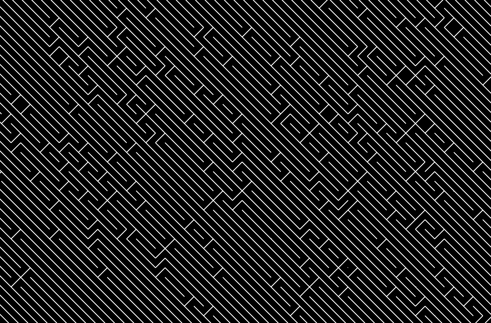
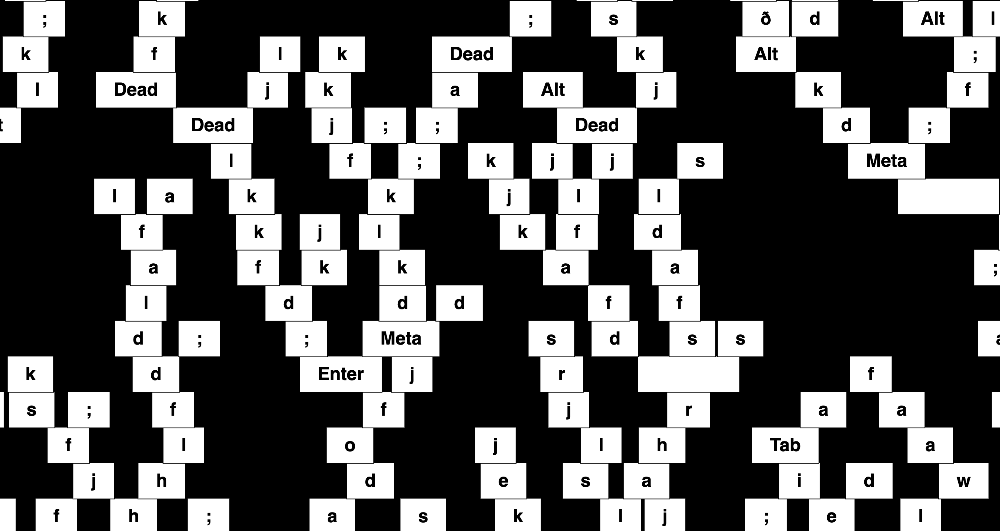
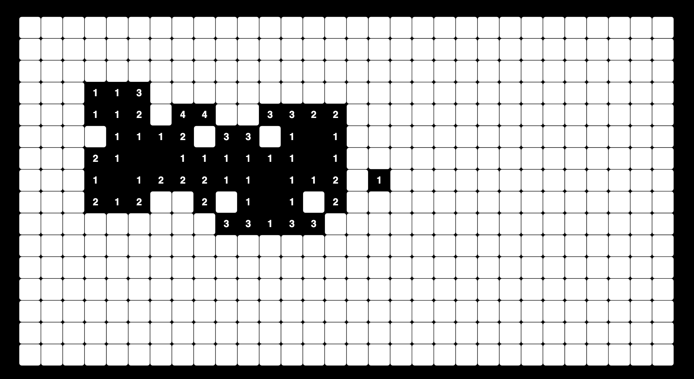
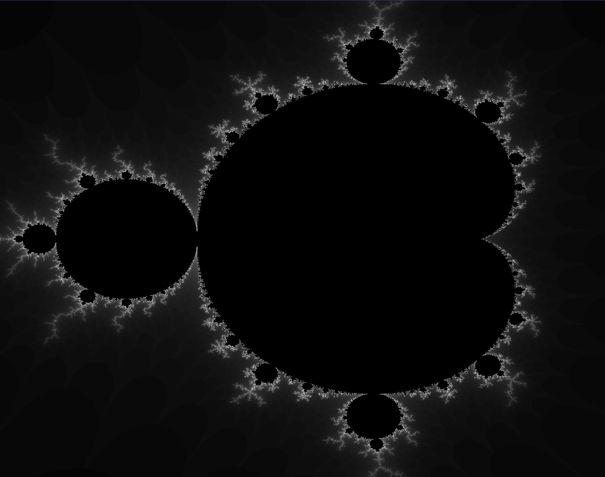
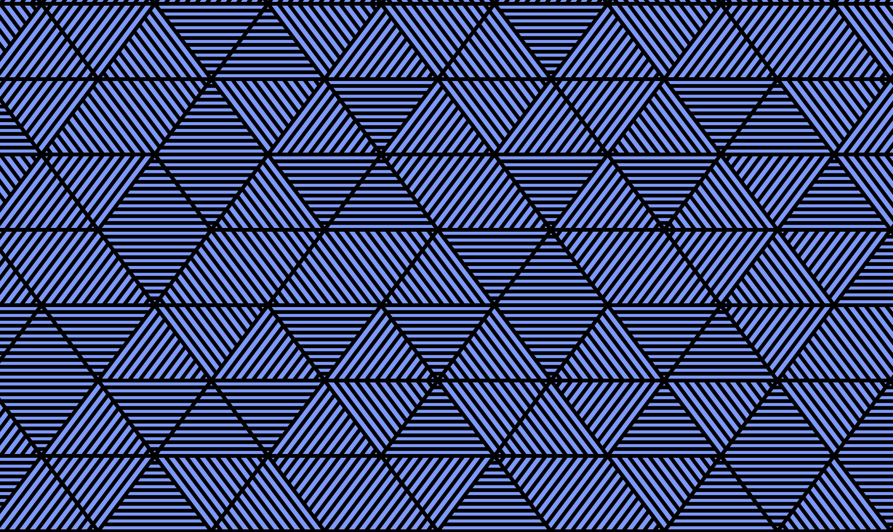

# stuff_with_p5
various things I have made with p5js library

index:

1. [10-print](1_10print)

2. [times table visualization with strings](2_cardioid_times_tables)

3. [key screen filler](3_key_filler)

4. [minesweeper game](4_minesweeper)

5. [mandelbrot set](5_mandelbrot_set)

6. [line filler that fills up triangles](6_line_triangle_filler)

